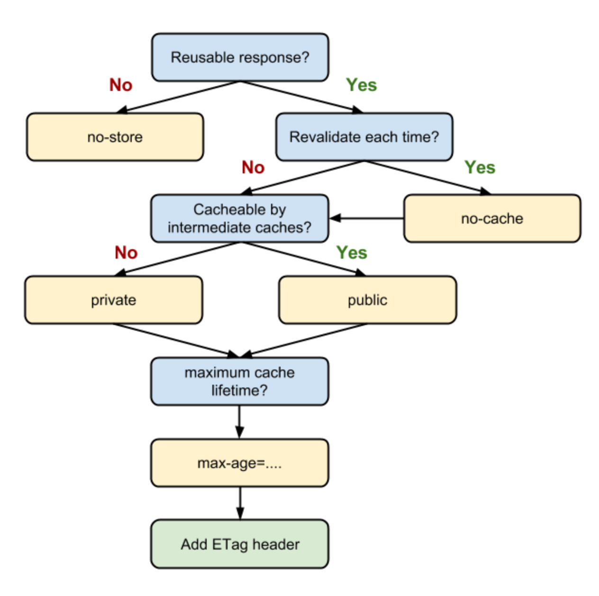
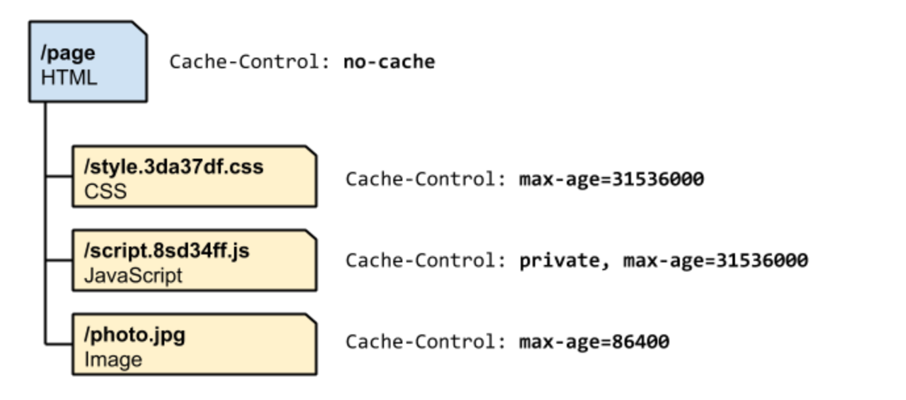
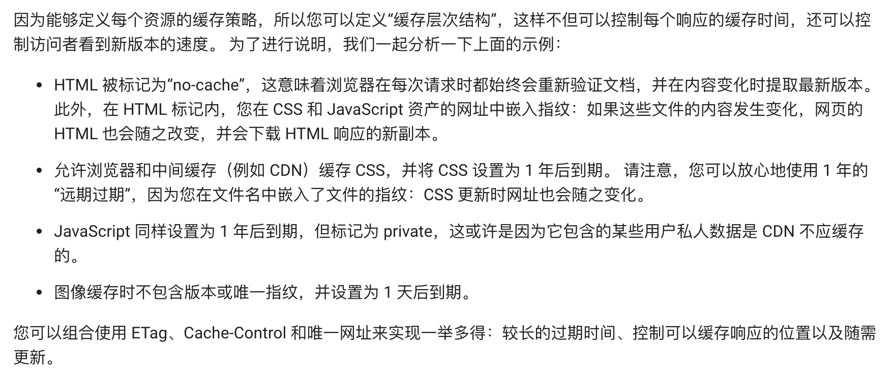

# 协商缓存
304 Not Modified  
ETag(If-Match, If-None-Match)  
Last-Modified(If-Modified-Since, If-Unmodified-Since)  

# 强制缓存
Cache-Control  

no-cache 必须先与服务器确认响应是否发生变化（HEAD请求），如果没变，就不需要重新下载  
no-store 禁止浏览器和中间缓存存储任何版本的响应  
public 大多数时候不必要  
private 只允许浏览器缓存响应，中间缓存不可以  
max-age 从请求的时间开始，允许响应被缓存的时长，单位秒  

# 最佳的Cache-Control策略

# 废弃和更新缓存的响应
在文件名中嵌入指纹或者版本号

# CheckList
- 对相同的资源使用一致的网址
- 服务器提供Etag
- 确定中间缓存可以缓存哪些资源
- 制定合适的缓存层次结构
- code split（webpack）
