## Web服务器的部署地点

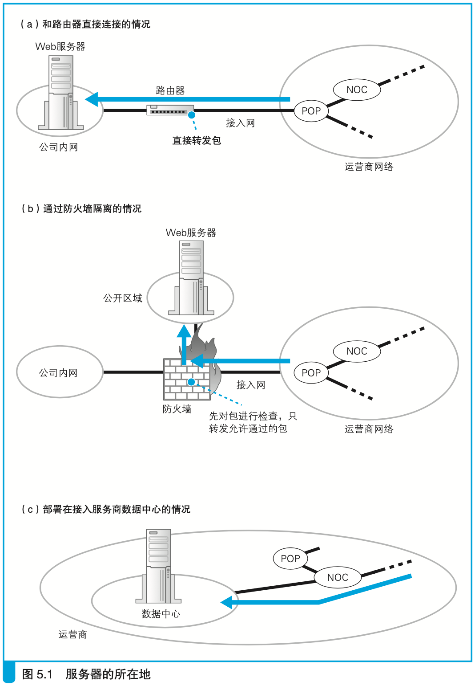

## 防火墙的结构和原理

### 包过滤规则

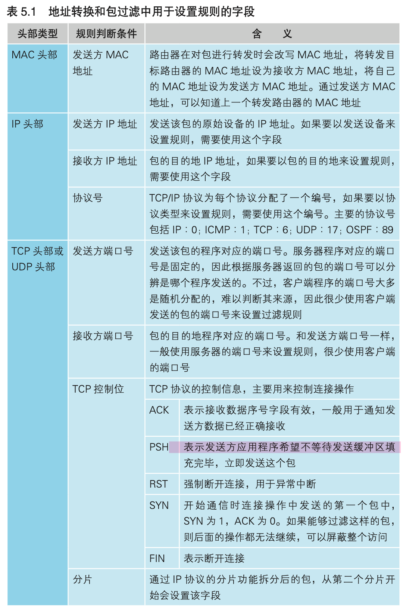

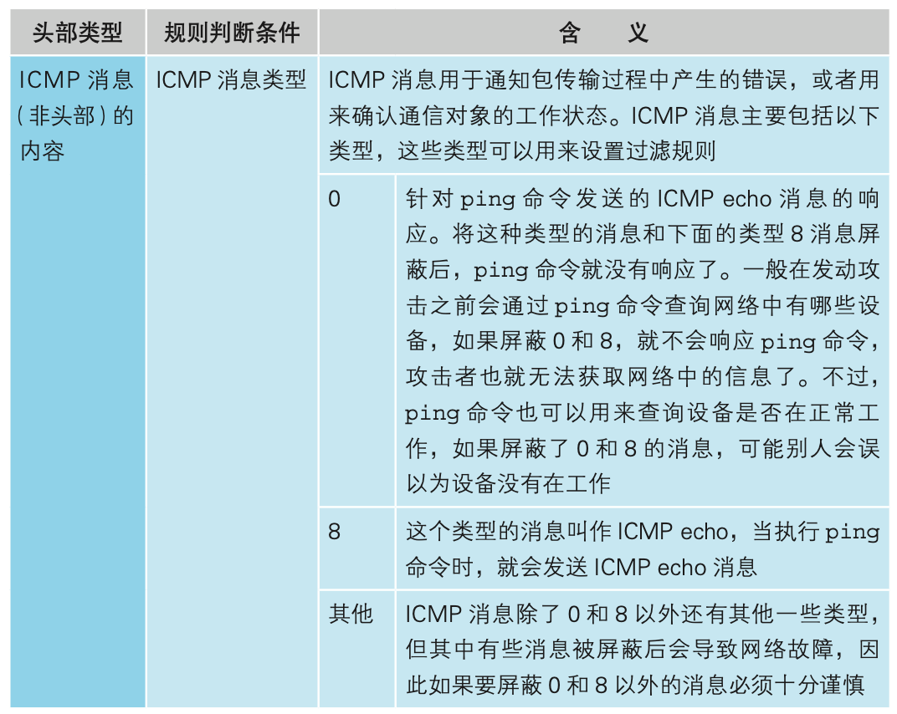

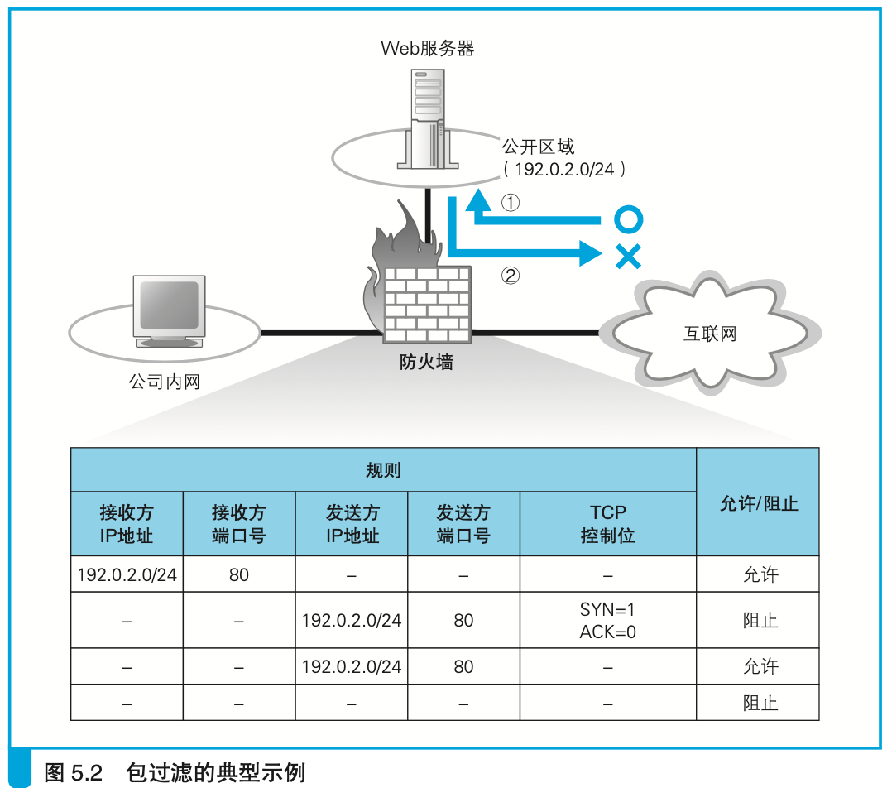

## 负载均衡

### 通过DNS查询来分配负载

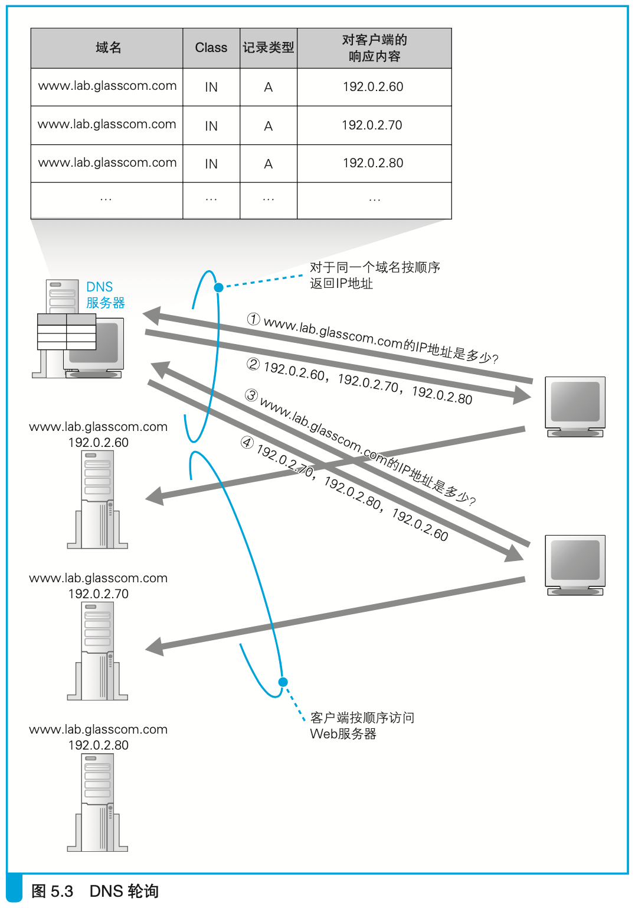

### 通过负载均衡器分配负载

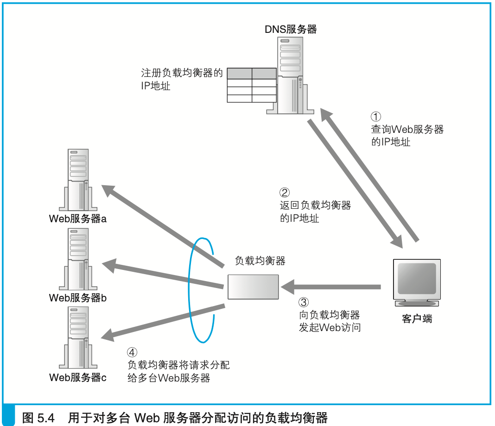

对于跨多个页面的操作，根据cookie转发到同一个服务器上，其他的不相关的操作，则根据性能负载情况发送到相应的服务器上。

## 缓存服务器

### 反向代理的例子

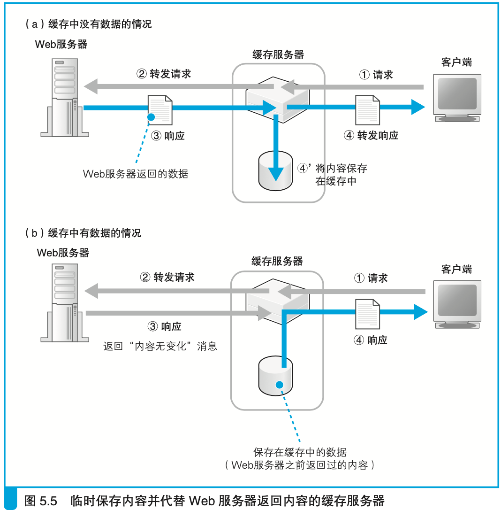

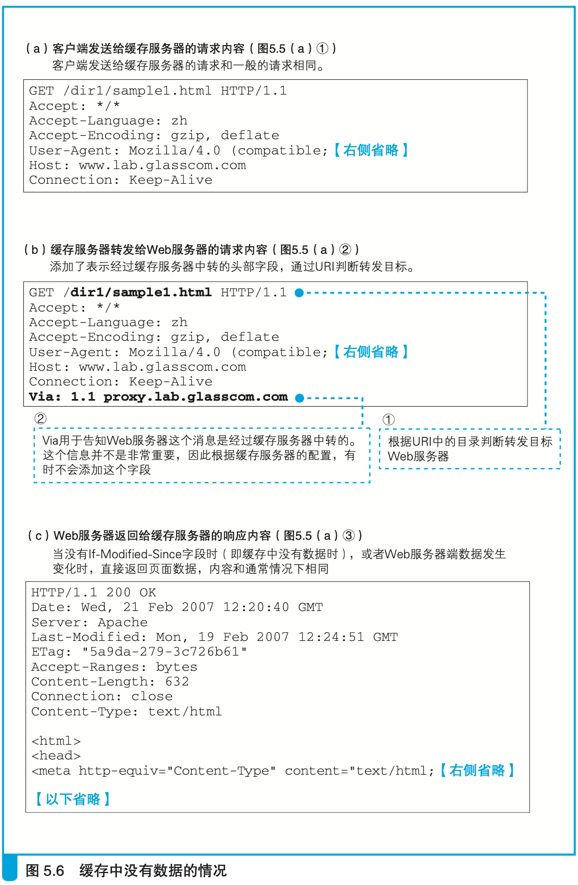

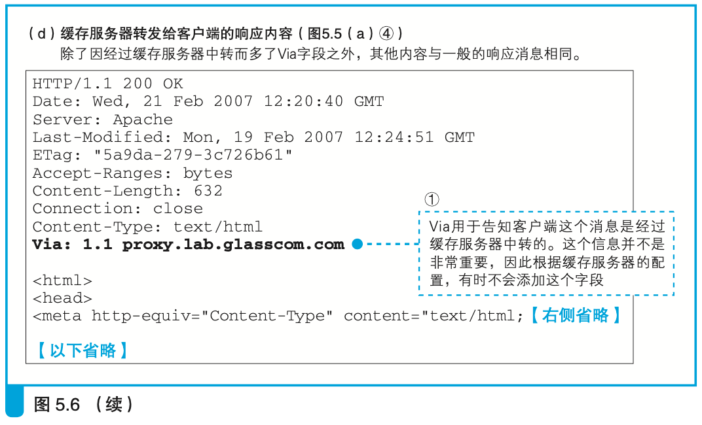

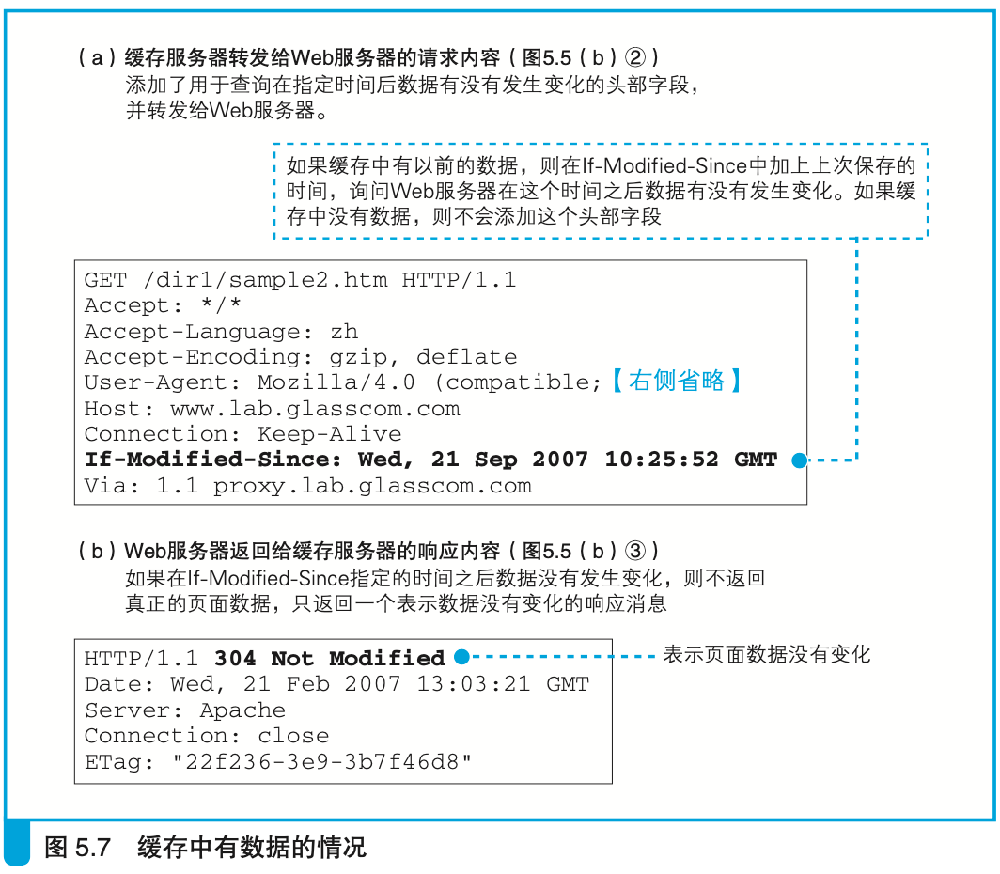

### 正向代理

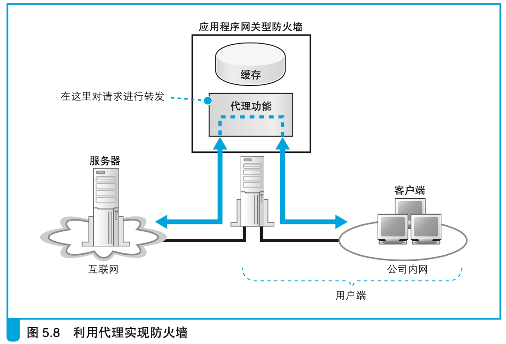

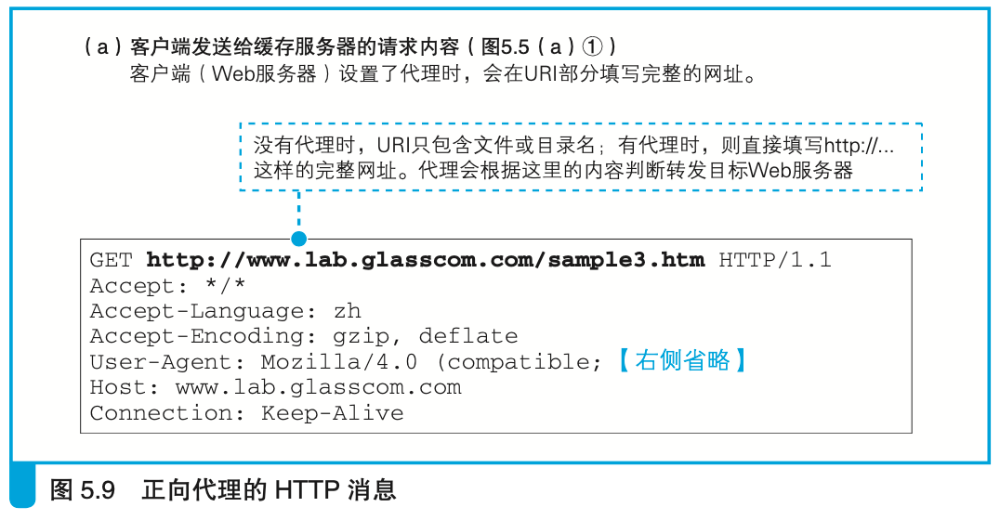

### 透明代理

透明代理集合了正向代理和反向代理的有点，不需要像正向代理一样设置浏览器，也不需要像反向代理一样在缓存服务器上设置转发目标，但是透明代理需要放置在请求消息从浏览器到服务器的路径中，一般放在接入网。

## 内容分发服务

CDN服务商与各大运营商签约部署缓存服务器，然后租赁给需要的企业客户。

### 如何找到最近的缓存服务器

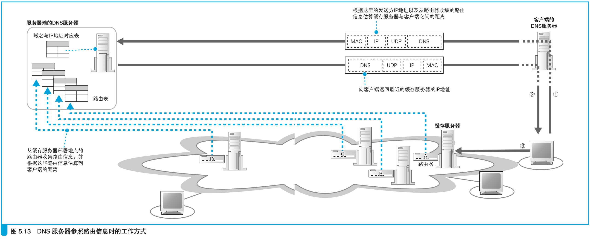

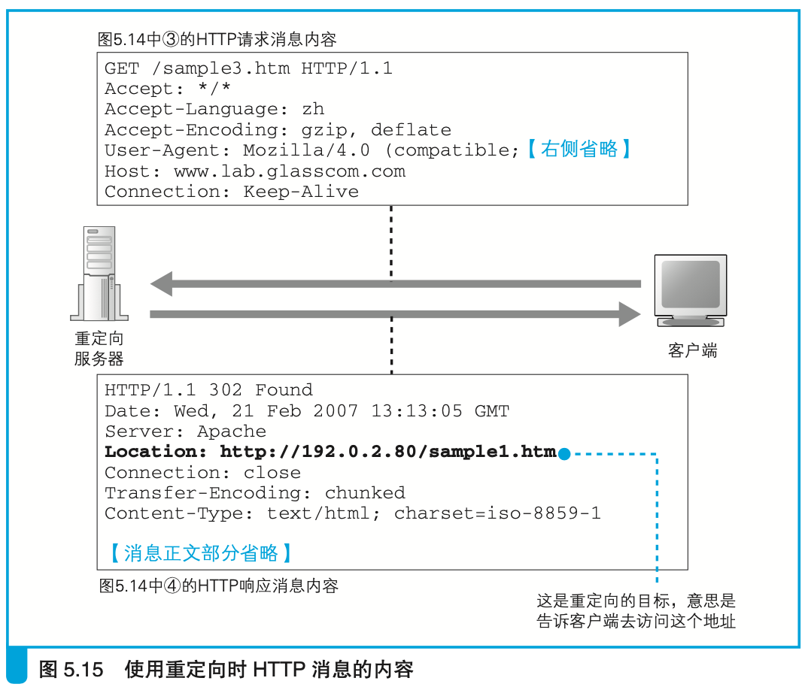

### 缓存更新方法

- 将曾经访问过的数据保存下来，等再次访问的时候拿出来用
- web服务器更新后立即通知缓存服务器
