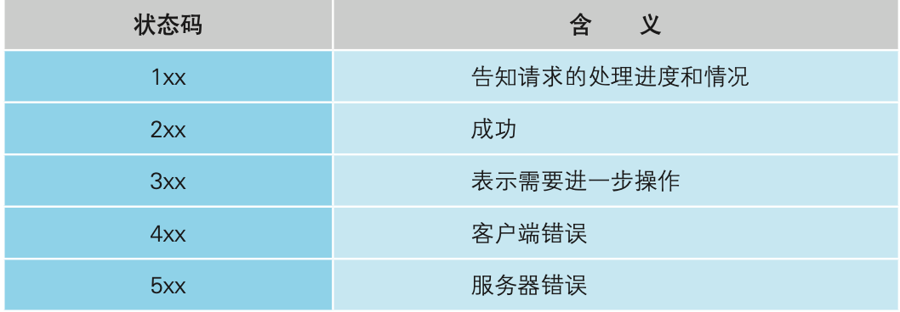
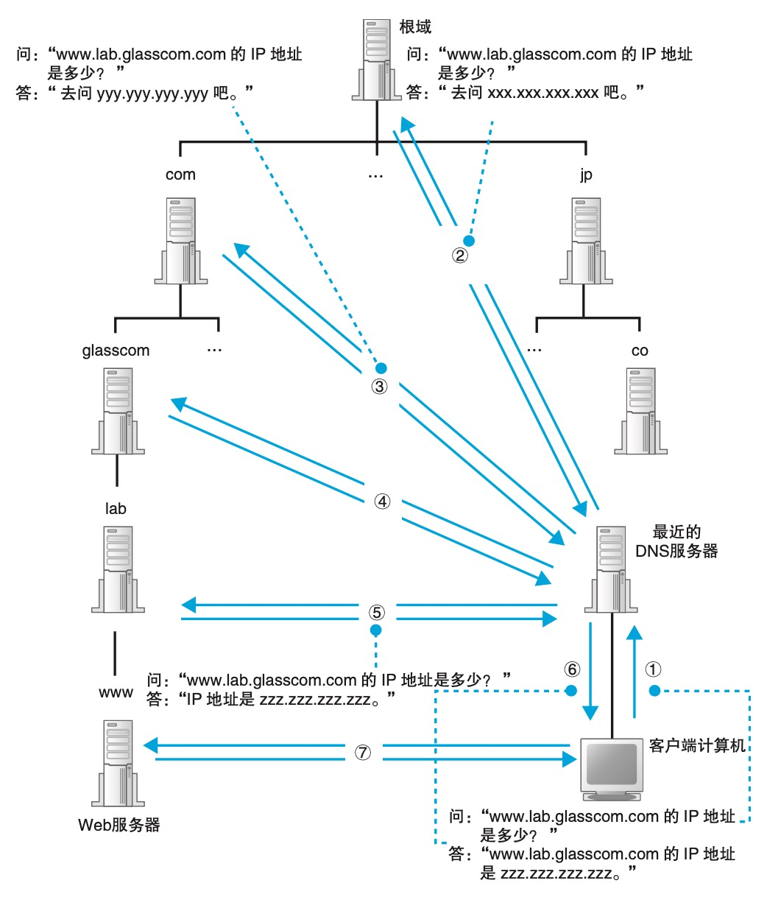
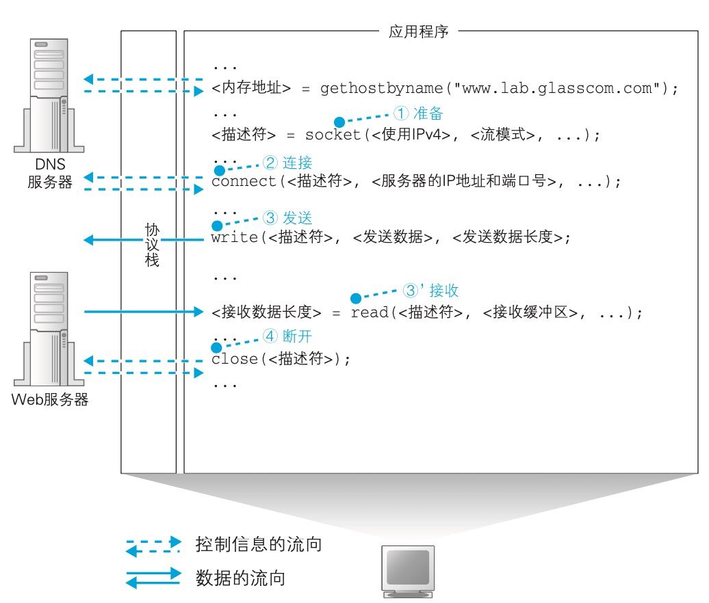

## 生成HTTP请求消息

### 省略文件名的情况
1. http://www.lab.glasscom.com/dir/  
访问默认文件，例如：/dir/index.html
2. http://www.lab.glasscom.com/  
访问默认文件，例如：/index.html
3. http://www.lab.glasscom.com  
访问默认文件，例如：/index.html
与b的不同在于，b指定了路径/
4. http://www.lab.glasscom.com/whatisthis  
先将whatisthis当成文件名访问，不存在的话，再当成目录名处理

### HTTP方法
- GET
- POST
- HEAD
- OPTIONS
- PUT
- DELETE
- TRACE
- CONNECT

### HTTP 头字段
#### 通用头
Date Pragma Cache-Control Connection Transfer-Encoding Via

#### 请求头
Authorization From If-Modified-Sinc Referer User-Agent Accept Accept-Charset
Accept-Encoding Accept-Language Host If-Match If-None-Match If-Unmodified-Since Range

#### 响应头
Location Server WWW-Authenticate Accept-Ranges

#### 消息体的附加信息头字段
Allow Content-Encoding Content-Length Content-Type Expires
Last-Modified Content-Language Content-Location Content-Range Etag

### 请求-响应
#### HTTP响应状态码

一个请求只能对应一个资源  
但资源中可能嵌有其他资源，浏览器会自动为这些资源发起请求

## DNS查询

### ip地址表示（ipv4）
网络号 + 主机号 共32位
1. IP地址主体表示方法  
10.11.12.13
2. 采用与IP地址主体相同的格式表示子网掩码  
10.11.12.13/255.255.255.0
3. 采用网络号比特数表示子网掩码  
10.11.12.13/24
4. 子网表示  
10.11.12.0/24（主机部分比特全0，代表整个子网）
5. 子网内广播地址表示  
10.11.12.255/24（主机部分比特全1，代表对整个子网广播）

### 为什么要使用域名
1. IP难记
2. 如果web服务器使用了虚拟主机功能，可能无法通过IP地址来访问

### 为什么不弃用IP
域名长且长度不固定，增加路由器处理负担

### DNS解析器
构造DNS请求，委托操作系统的协议栈（TCP/IP驱动）执行请求

DNS请求内容  
- 域名
- Class （因特网 IN）
- 记录类型 （域名 A，邮件服务器 MX，IP地址反查域名 PTR，查询域名别名 CNAME，查询DNS服务器IP地址 NS，查询域名属性信息 SOA）

### DNS接力
域名是有灵活的层次结构的:  
根域(.) -> 顶级域(com) -> ...(子域) -> 名字(www)

通过缓存可以加快DNS服务器的响应  
一台DNS服务器可以管理多个域，但一个域只能在一台DNS服务器（确切说，是使用一个IP地址的DNS服务器）中

## 委托协议栈发送消息

建立TCP连接
1. 服务器创建套接字，等待客户端连接
2. 客户端创建套接字
3. 客户端套接字连接服务器端套接字，形成管道
4. 收发数据
5. 断开管道并删除套接字（服务器端或客户端发起，一方断开，另一方也随之断开，管道断开后，套接字也会被删除）

tips:
- 套接字创建完成后返回一个描述符（用来区别不同的套接字）

描述符:应用程序用来识别套接字的机制  
IP地址和端口号:客户端和服务器之间用来识别对方套接字的机制
