## 创建套接字

### 协议栈内部结构
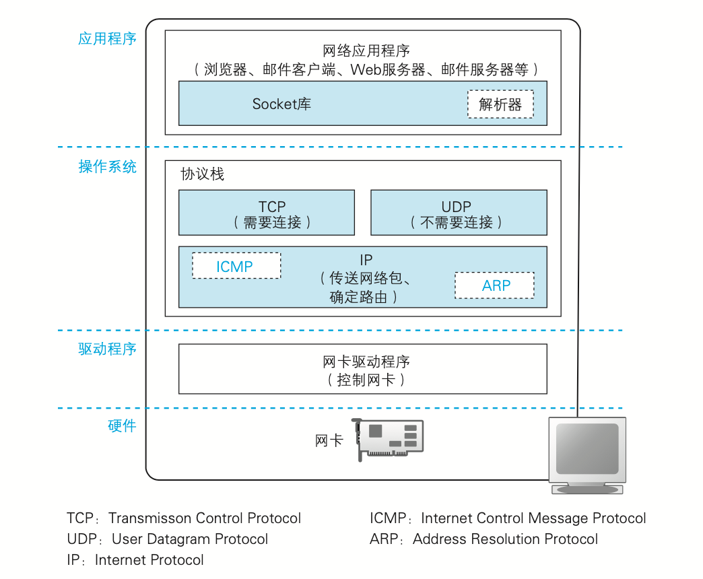

### 套接字的实体就是通讯控制信息
通讯控制信息包括：
- IP
- 端口号
- 通信状态（成败，时间等）

注意：创建套接字时，并未指定IP和端口  

### 调用socket时的操作
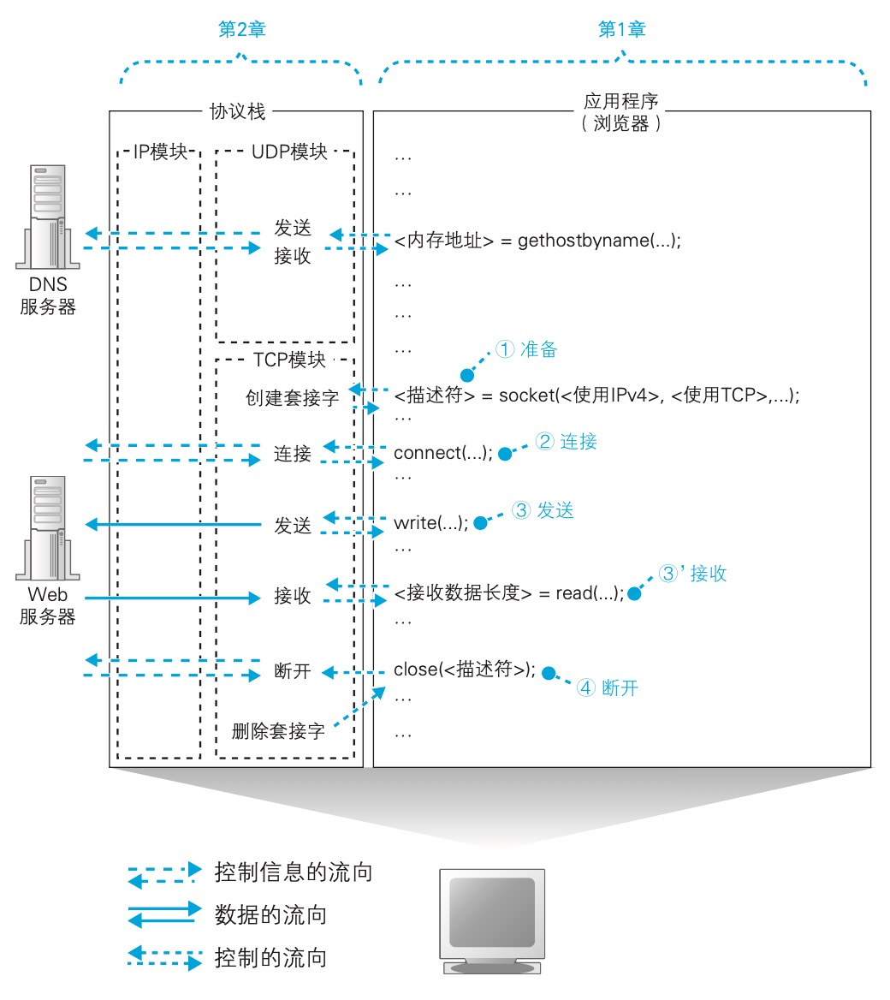

## 连接服务器

### 连接的意义
连接就是交换控制信息，并在套接字中记录，同时分配临时的内存空间用来存放收发的数据

### 关于控制信息
控制信息分为两大类：
- 保存在套接字中的控制信息  
  * 应用程序传来的信息和从通信对象接受的信息都保存在这里
  * 收发数据操作的执行状态等信息也保存在这里（用来控制协议栈操作）
  * 套接字的控制信息和协议栈程序是一体的，因而可以有多种实现
- 保存在包头部的控制信息  
  * 这些信息不仅连接时需要，包括数据收发和断开连接在内，整个通信过程都需要
  * 是固定的，要遵循标准

### TCP包结构

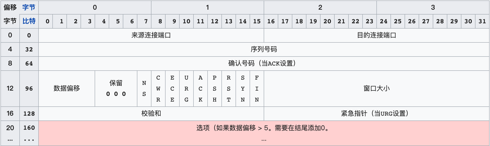

数据偏移（4位长）—以4字节为单位计算出的数据段开始地址的偏移值。

### 握手

- SYN=1 ACK=0 序号=Random Number 窗口=？  Client to Server
- SYN=1 ACK=1 ACK号=Client序号+1 序号=Random Number 窗口=？  Server to Client(向套接字写入服务器的IP和端口号，状态改为连接完毕)
- ACK=1 ACK号=Server序号+1 Client to Server

## 收发数据

应用程序将要发送的数据交给协议栈，并告知长度，协议栈并不关心数据内容，在其看来，数据都是一定长度的二进制字节序列。

### 协议栈会根据数据长度和时间权衡发送的策略

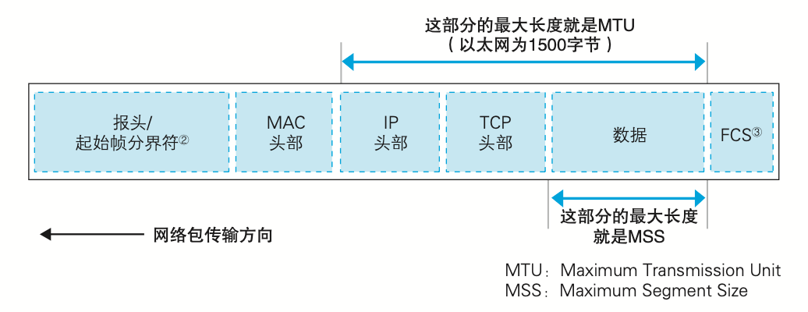

### ACK号

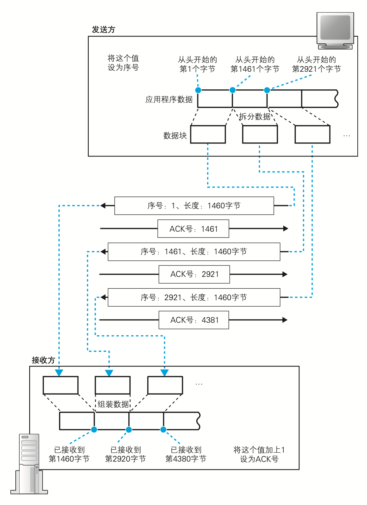

TCP 采用这样的方式确认对方是否收到了数据，在得到对方确认之前，发送过的包都会保存在发送缓冲区中。如果对方没有返回某些包对应 的 ACK 号（超时），那么就重新发送这些包。

#### 根据网络包平均往返时间调整ACK号等待时间

关于ACK号超时时间的设定，TCP 采用了动态调整等待时间的方法，这个等待时间是根据 ACK 号返回所需的时间来判断的。具体来说，TCP 会在发送数据的过程中持续测量 ACK 号的返回时间，如果 ACK 号返回变慢，则相应延长等待时间;相对地，如果 ACK 号马上就能返回，则相应缩短等待时间。

### 窗口

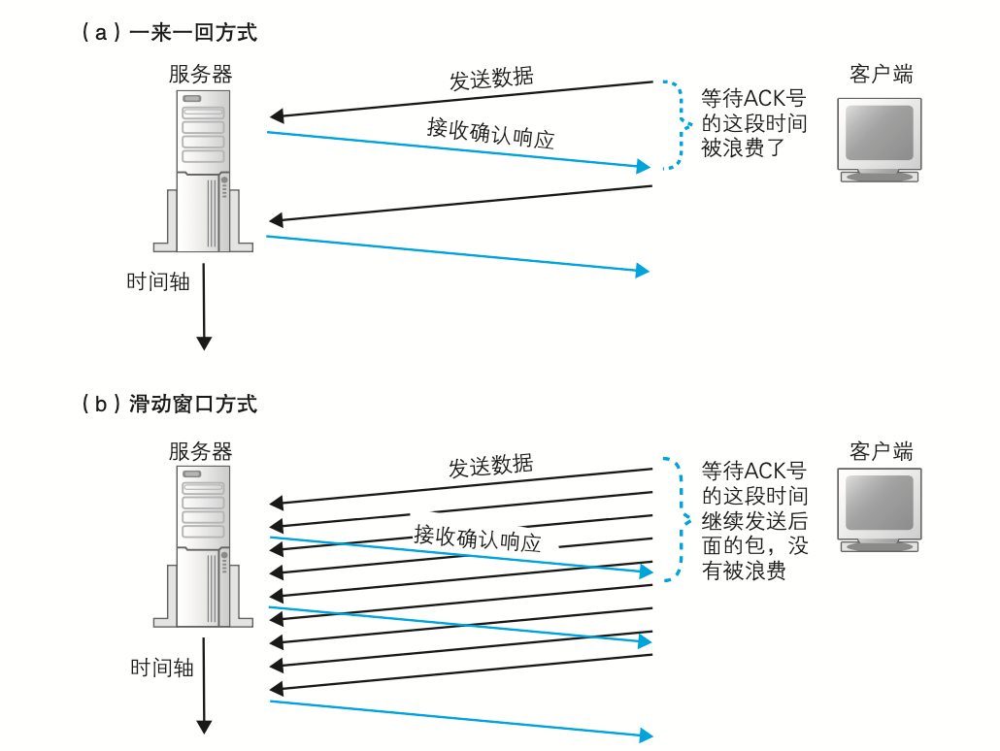

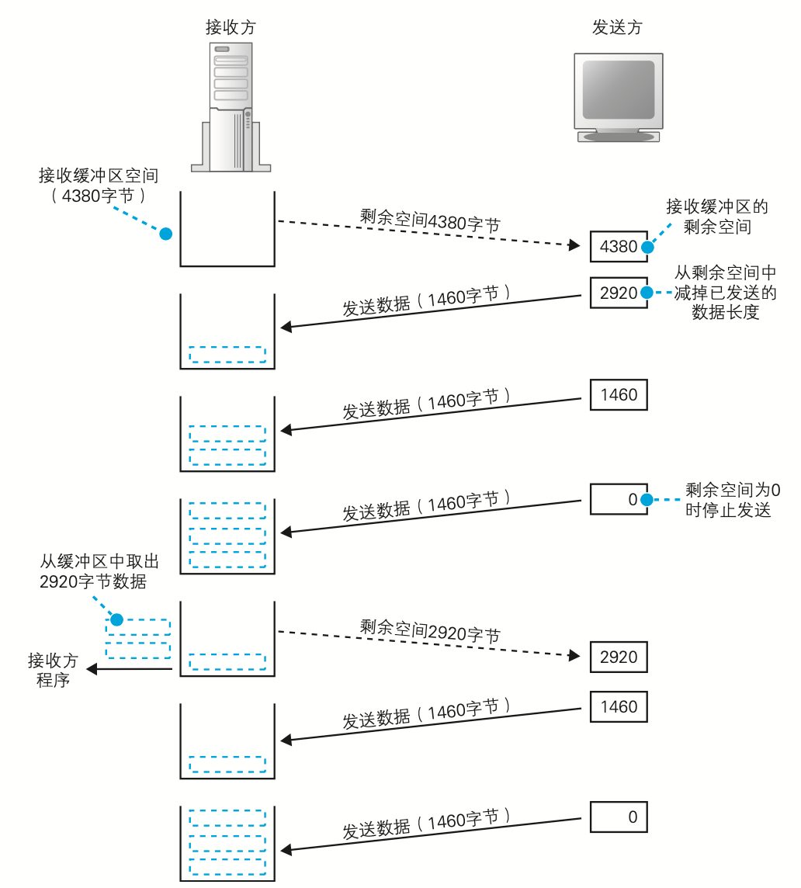

窗口大小一般和接收方的缓冲区大小一致。

### ACK与窗口合并

接收方在发送 ACK 号和窗口更新时，并不会马上把包发送出 去，而是会等待一段时间，在这个过程中很有可能会出现其他的通知操作， 这样就可以把两种通知合并在一个包里面发送了。

当需要连续发送多个 ACK 号时，也可以减少包的数量，这是因为 ACK 号表示的是已收到的数据量，也就是说，它是告诉发送方目前已接收的数据的最后位置在哪里，因此当需要连 续发送 ACK 号时，只要发送最后一个 ACK 号就可以了，中间的可以全部省略。

当需要连续发送多个窗口更新时也可以减少包的数量，因为连续发生窗口更新说明应用程序连续请求了数据，接收缓冲区的剩余空间连续增加。这种情况和 ACK 号一样，可以省略中间过程，只要发送最终的结果就可以了。

## 从服务器断开并删除套接字

### 挥手

HTTP/1.0 响应发送完成后，由服务端发起断开

HTTP/1.1 服务器返回响应后，客户端可以接着发起下一个请求，如果没有请求要发送了，客户端发起断开

无论哪种情况，完成数据发送的一方会发起断开过程

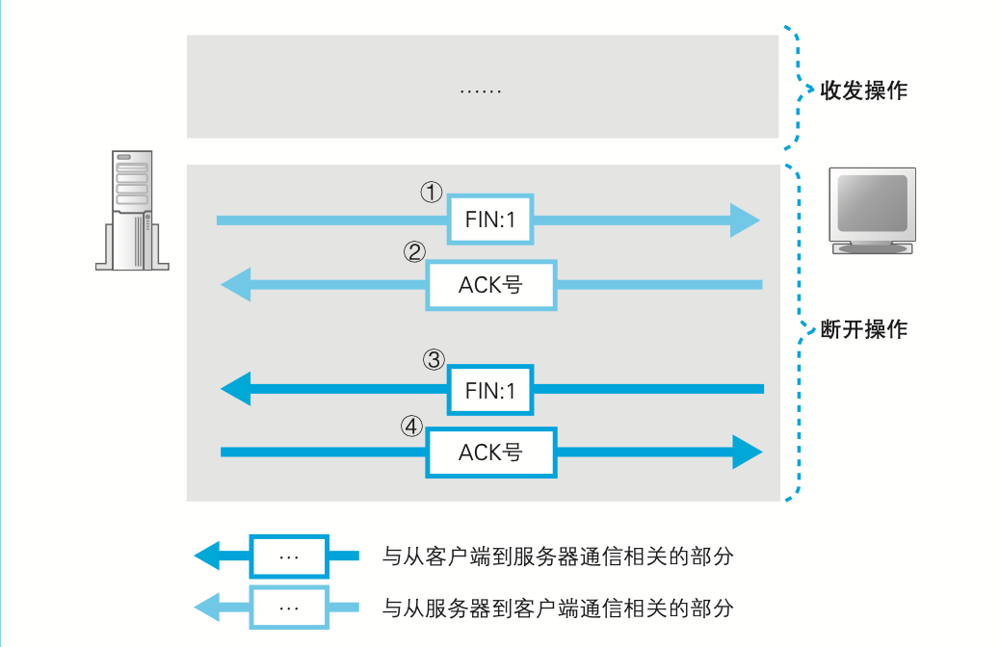

### 删除套接字

套接字不会被立即删除，而是等待一段时间后删除，这是为了防止误操作

被动方发送FIN后（上图3）等待1个MSL，如果还没收到ACK，就再发送一次FIN，直到收到ACK或者重试次数超过限制后删除套接字

主动方发送ACK后（上图4）等待2个MSL，如果期间又收到了FIN，重复这个过程，否则删除套接字

1个MSL为120秒

## 小结

## IP和以太网的包收发

### 包的基本知识

1. IP协议根据目标地址判断下一个IP转发设备的位置
2. 子网中的以太网协议将包传输到下一个转发设备

### IP模块和MAC模块职责

- IP模块添加IP头部和MAC头部，并不关心包的内容（TCP模块的工作）
- MAC模块添加3个额外的控制数据

### IP头部

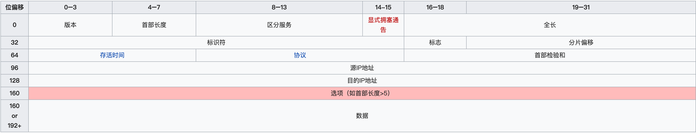

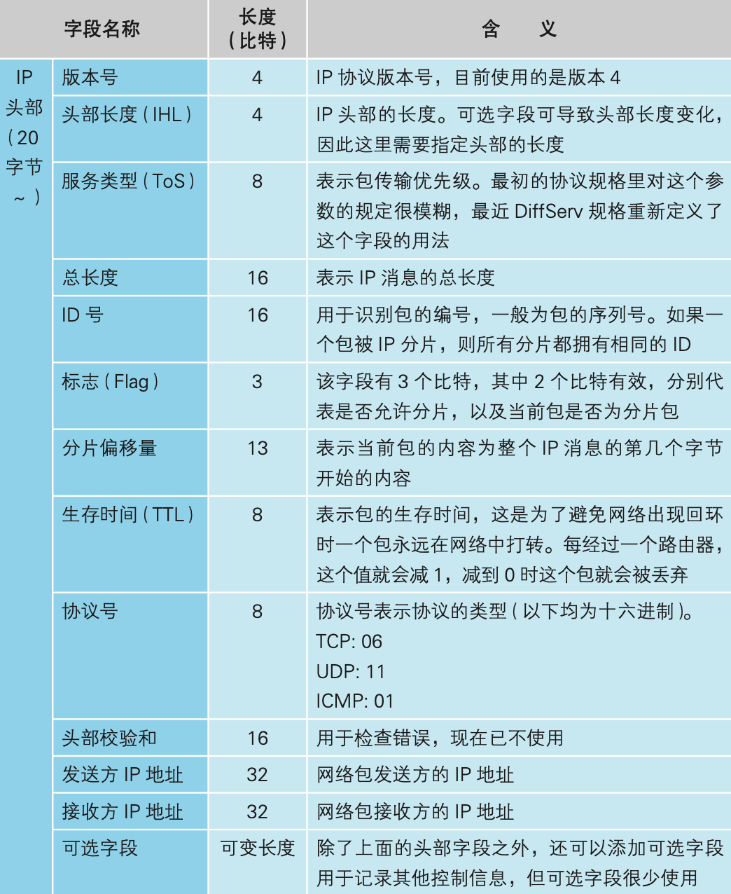

### MAC头部

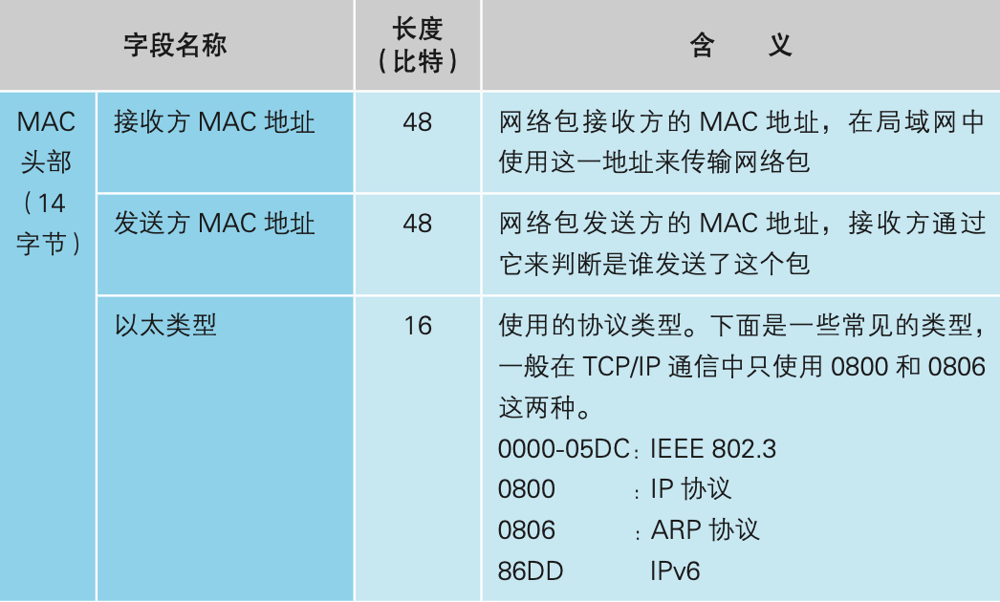

ARP协议通过广播查询接收方MAC地址，再将MAC地址写入MAC头部中的接收方MAC地址

### 以太网的性质

- 将包发送到MAC头部的接收方MAC地址代表的目的地
- 用发送方MAC地址识别发送方
- 用以太类型识别包的内容

无线局域网跟有线局域网大致相同，可以替换使用

### 给MAC帧添加3个控制数据

MAC模块将包取出，再在头尾加3个控制数据。

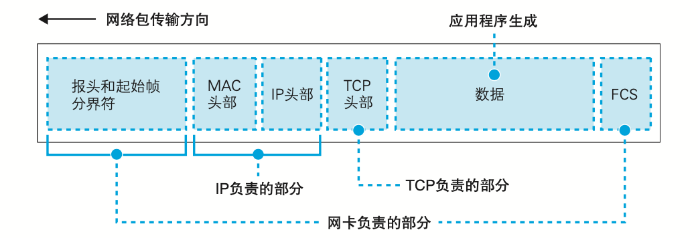

末尾的FCS（帧校验序列）用来检查包传输过程中因噪声导致的波形紊乱和数据错误，它是一串32比特的序列

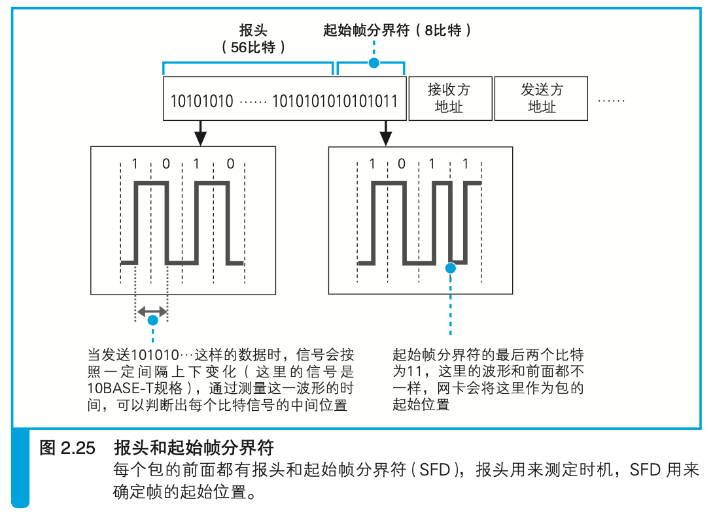

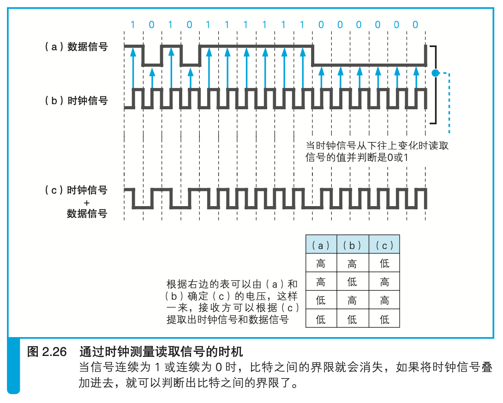

仅凭数据信号无法区分比特的边界，因此需要同时发送时钟信号。有两种方案：

1. 数据信号和时钟信号一起发送，当时钟信号从下向上变化时，读取电压电流，并和0、1对应，但这种方式存在问题，当距离较远，网线较长，两个信号会产生时间差，从而发生时钟偏移。
2. 数据信号和时钟信号叠加发送（异或），通过观测报头可以得知时钟信号的频率，进而提取出数据信号

### 发送包

- 使用集线器的半双工模式
  在半双工模式中，为了避免信号碰撞，需要先判断网线中是否存在其他信号，如果有就停止发送数据，为了通知其他设备当前线路发生碰撞，还会发送一段时间的阻塞信号。等待一段时间（根据MAC地址生成一个随机数）后，会尝试重新发送信号。当网络拥塞时，重新发送可能会再碰撞，这时会将等待时间延长一倍，重试10次后报告通信错误。

- 使用交换机的全双工模式

  

#### PHY模块的职责

- MAC模块产生的是通用信号（MAC帧+3个控制字段），然后由PHY模块转换成可在网线中传输的格式（时钟信号叠加、编码等），并通过网线发送出去

- 监控接收线路中有没有信号进来

### 接收包

1. 无论是不是发给自己的信号都接收进来
2. PHY通过报头同步时钟，遇到起始帧分界符开始将后面的信号转换成数字信息，然后交给MAC模块
3. MAC模块再从头开始将信号转换成数字信息，并存放到缓冲区，处理到信号末尾时还要检查FCS，错误包丢弃
4. 判断接收方MAC地址与自己的MAC地址是否一致（混杂模式不判断），一致则放入缓存区
5. 网卡通过中断机制通知计算机，中断处理程序调用网卡驱动，控制网卡执行接收操作
6. 网卡驱动从网卡的缓冲区取出收到的包，通过MAC头部中的以太类型字段判断协议类型
7. 如果是IP协议，就交给TCP/IP协议栈
8. IP模块检查IP头部，确认格式是否正确
9. IP模块查看接收方IP地址，如果不是自己的地址，则分两种情况
   - 系统具备和路由器一样的包转发功能，就转发出去
   - 系统不具备此功能，就发送ICMP消息将错误告知发送方
10. IP模块将分片的数据组装成原始包，交给TCP模块
11. TCP模块根据IP头部中的接收方和发送方的IP地址，以及TCP头部中的接收方和发送方的端口号来查找到对应的套接字
12. 如果包的内容是应用程序数据，则返回ACK包（可能和窗口大小包合并），如果是建立或断开连接的控制包，则返回相应的响应控制包，并通知应用程序建立和断开连接的操作状态

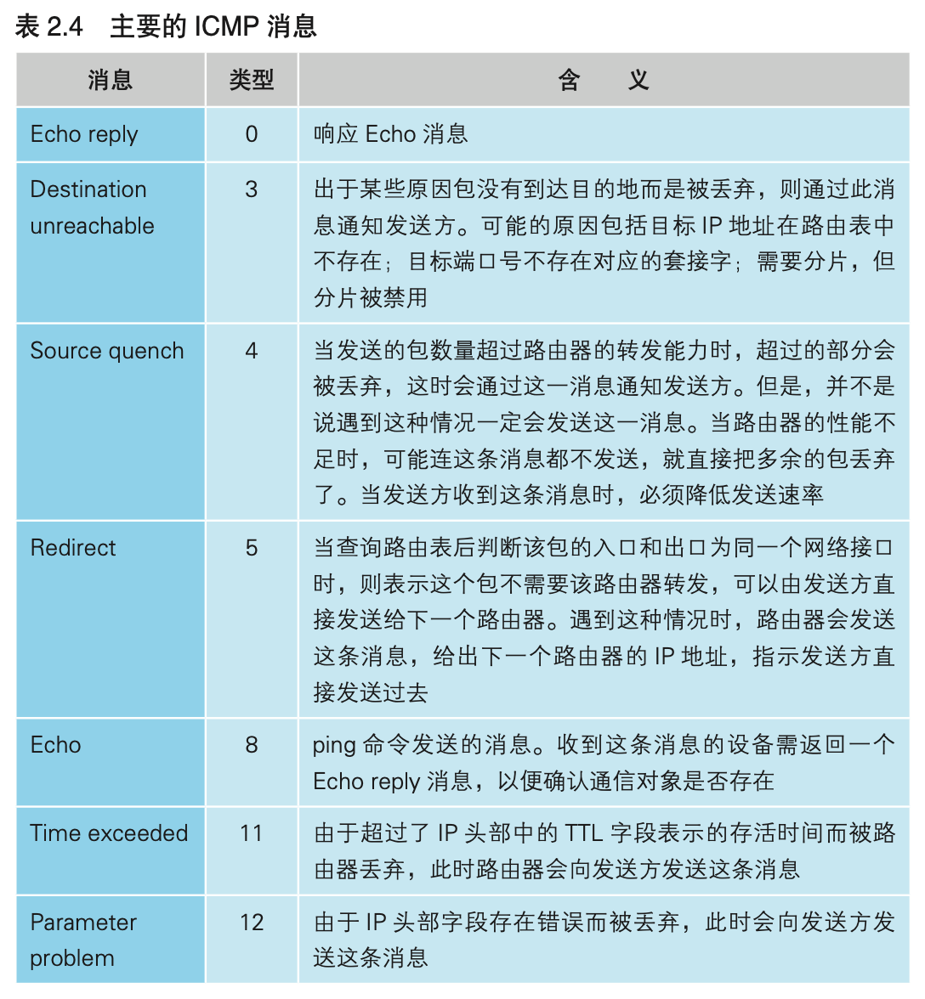

## UDP

UDP可发送的数据最大长度为IP包的最大长度减去IP头部和UDP头部的长度。

IP包最大长度由IP头部中的“全长”字段确定，该字段16比特，最大值为65535。

由应用程序来处理包丢失的问题，没收到回复就重发

UDP使用场景

- 控制用的短数据
- 游戏和直播等无需重发或者重发了也没什么意义的数据
